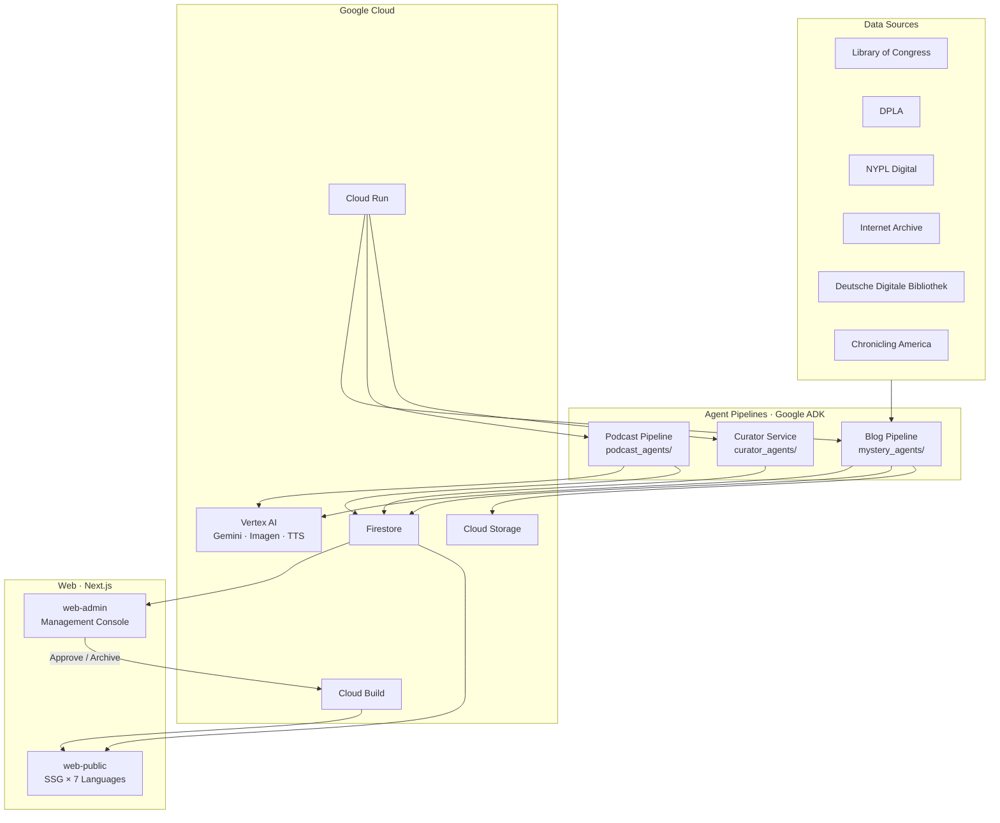
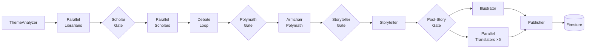
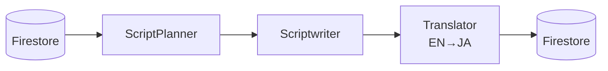

# Ghost in the Archive

> Autonomous AI agents that excavate historical mysteries and folklore from public digital archives — and transform them into multilingual narratives, illustrations, and podcasts.

## Overview

Public digital archives hold millions of digitized documents spanning centuries of human history. Hidden within them are **unresolved contradictions**, **vanished persons**, and **unexplained phenomena** that no one has connected — until now.

**Ghost in the Archive** deploys a coordinated team of AI agents that autonomously:

1. **Excavate** primary sources from archives (Library of Congress, DPLA, NYPL, Internet Archive, Deutsche Digitale Bibliothek)
2. **Analyze** them through interdisciplinary scholarly debate (history, folklore, anthropology)
3. **Synthesize** findings into long-form narratives, AI-generated illustrations, and podcast episodes
4. **Publish** across a multilingual web platform (7 languages) and podcast distribution

### Design Philosophy: Fact × Folklore

The system targets both **verifiable historical anomalies** (date discrepancies, missing persons, document gaps) and **cultural memory** (local beliefs, taboos, urban legends, unexplained phenomena). The fusion of these two approaches produces narratives that are neither dry academic research nor sensational fiction.

## Architecture



## Agent Pipelines

### Blog Pipeline (`mystery_agents/`)

Fully autonomous content generation — from archival research to published multilingual article.



**Agents:**

| Agent | Role | Model |
|-------|------|-------|
| **ThemeAnalyzer** | Theme analysis and language selection | Gemini 2.5 Flash |
| **Librarian** ×N | Archival research across 6 digital archives + folklore sources | Gemini 2.5 Flash |
| **Scholar** ×N | Interdisciplinary analysis (analysis mode) + cross-language debate (debate mode) | Gemini 3 Pro |
| **Armchair Polymath** | Cross-language synthesis — integrates all analyses with scholarly authority | Gemini 3 Pro |
| **Storyteller** | Long-form English narrative balancing historical rigor and eerie atmosphere | Gemini 3 Pro |
| **Illustrator** | Hero image generation with LLM-based safety rewriting | Gemini 3 Pro + Imagen 3 |
| **Translator** ×6 | Parallel translation to ja/es/de/fr/nl/pt with per-language tone guidelines | Gemini 2.5 Flash |
| **Publisher** | Firestore persistence and Cloud Storage asset upload | Gemini 2.5 Flash |

**Pipeline Gates (Cascade Failure Protection):**

Each gate is a `before_agent_callback` that halts the pipeline early when upstream agents produce no usable output, preventing wasted API calls and nonsensical content.

| Gate | Checks | Skips when |
|------|--------|-----------|
| ScholarGate | `collected_documents_{lang}` | All Librarians returned NO_DOCUMENTS_FOUND |
| PolymathGate | `scholar_analysis_{lang}` | All Scholars returned INSUFFICIENT_DATA |
| StorytellerGate | `mystery_report` | Empty or failure marker |
| PostStoryGate | `creative_content` | Empty or NO_CONTENT |

### Podcast Pipeline (`podcast_agents/`)

On-demand podcast episode generation from published articles, triggered via the admin console.



| Agent | Role | Model |
|-------|------|-------|
| **ScriptPlanner** | Designs 5–7 segment outlines with word-count budgets and tone directions | Gemini 2.5 Flash |
| **Scriptwriter** | Segment-by-segment sequential script generation for quality stability | Gemini 3 Pro |
| **Translator** | Japanese translation of podcast script | Gemini 2.5 Flash |

### Curator Service (`curator_agents/`)

Theme suggestion agent invoked by Cloud Scheduler. Proposes new investigation topics while consulting `pipeline_failures` to avoid themes that previously failed.

## Web

| App | Tech | Description |
|-----|------|-------------|
| **web-public** | Next.js SSG | Static site in 7 languages (en/ja/es/de/fr/nl/pt). `React.cache` optimizes Firestore queries from 7N to 1. Rebuilt via Cloud Build on article approval. |
| **web-admin** | Next.js CSR | Management console — article review (approve/archive), podcast production, theme suggestions. |
| **@ghost/shared** | TypeScript | Shared types, Firebase config, Firestore queries, localization (`localizeMystery()`), and UI components. |

## Project Structure

```
shared/                       # Python shared infrastructure
├── firestore.py              # Firebase Admin init, Firestore/Storage clients
├── model_config.py           # LLM model config (retry-enabled Gemini factory)
├── constants.py              # Language / schema / status constants
├── orchestrator.py           # Pipeline orchestration logic
├── state_registry.py         # State dependency registry + Mermaid generation
├── http_retry.py             # External API retry strategy
└── pipeline_failure.py       # Failure logging (Firestore + Curator integration)

mystery_agents/               # Blog pipeline
├── agent.py                  # root_agent = ghost_commander
├── agents/                   # ThemeAnalyzer, Librarian, Scholar, Polymath,
│                             # Storyteller, Illustrator, Translator, Publisher
├── tools/                    # Archive APIs, debate tools, image gen, publishing
├── schemas/                  # Mystery ID schema (FBI-inspired classification)
└── utils/                    # PipelineLogger

curator_agents/               # Theme suggestion service
├── agents/                   # Curator agent definition
└── queries.py                # Firestore queries for theme history

podcast_agents/               # Podcast pipeline
├── agent.py                  # root_agent = podcast_commander
├── agents/                   # ScriptPlanner, Scriptwriter
└── tools/                    # TTS, podcast Firestore tools

services/                     # Cloud Run service entrypoints
├── pipeline_server.py        # Blog + Podcast pipeline API
└── curator.py                # Curator service API

packages/shared/              # TypeScript shared code (@ghost/shared)
├── src/types/                # Type definitions (Mystery, TranslatedContent)
├── src/lib/                  # Firebase config, Firestore queries, localization, utils
└── src/components/           # Shared UI components

web-admin/                    # Next.js management console
web-public/                   # Next.js public site (7 languages)

tests/
├── unit/                     # Unit tests (fully mocked)
├── integration/              # Integration tests (Firebase Emulator)
├── eval/                     # ADK evaluation (Golden Dataset)
└── fixtures/                 # Test data
```

## Getting Started

### Prerequisites

- Python 3.12+
- [uv](https://docs.astral.sh/uv/) (Python package manager)
- Node.js 20+
- Google Cloud project with Vertex AI enabled
- Firebase project (Firestore + Cloud Storage)

### Setup

```bash
# Clone and install Python dependencies
git clone https://github.com/tyuichi/ghostinthearchive.git
cd ghostinthearchive
uv venv && source .venv/bin/activate
uv sync

# Configure environment
cp .env.example .env
# Edit .env with your API keys and project settings

# Install web dependencies
cd web-admin && npm install && cd ..
cd web-public && npm install && cd ..

# (Optional) Start Firebase Emulator for local development
firebase emulators:start --only firestore,storage
```

### Usage

```bash
# Run blog pipeline with a research query
python -m mystery_agents "Investigate the 1872 disappearance of the Mary Celeste crew"

# Run podcast pipeline for a published article
python -m podcast_agents --mystery-id OCC-MA-617-20260207143025

# Run curator to suggest new themes
python -m curator_agents

# Run tests
python -m pytest tests/unit/ -v
```

## Tech Stack

| Layer | Technology |
|-------|-----------|
| **Agent Framework** | Google Agent Development Kit (ADK) |
| **LLM** | Gemini 3 Pro / 2.5 Flash (via Vertex AI) |
| **Image Generation** | Imagen 3 (via Vertex AI) |
| **Text-to-Speech** | Google Cloud TTS / Chirp 3 |
| **Compute** | Cloud Run |
| **Database** | Firestore |
| **Storage** | Cloud Storage |
| **Scheduling** | Cloud Scheduler |
| **CI/CD** | Cloud Build (SSG rebuild on article approval) |
| **Web Framework** | Next.js 15 |
| **Language** | Python 3.12 / TypeScript |
