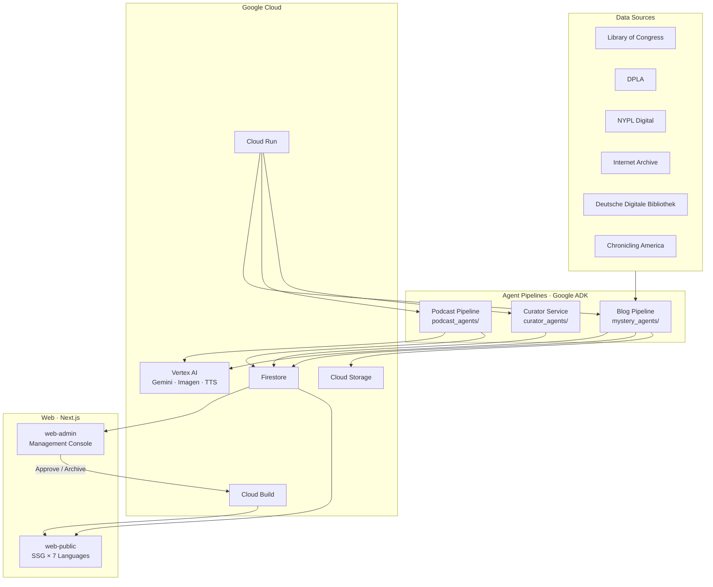
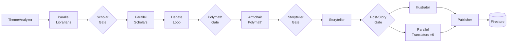
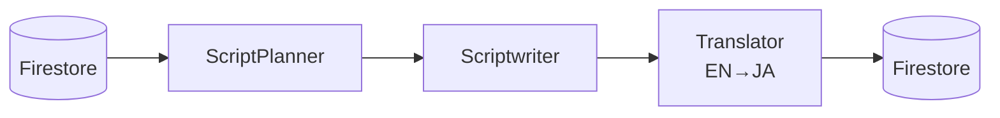

# Ghost in the Archive

> 公開デジタルアーカイブから歴史的ミステリーと民俗学的怪異を発掘し、多言語ナラティブ・イラスト・ポッドキャストへと変換する自律型 AI エージェントシステム。

## 概要

公開デジタルアーカイブには、数世紀にわたる人類の歴史を記録した数百万の文書が眠っている。その中には、誰も結びつけたことのない **未解決の矛盾**、**消えた人物**、**説明不能な現象** が隠されている。

**Ghost in the Archive** は、以下を自律的に実行する AI エージェントチームを展開する:

1. **発掘** — アーカイブ（Library of Congress, DPLA, NYPL, Internet Archive, Deutsche Digitale Bibliothek）から一次資料を収集
2. **分析** — 学際的な討論（歴史学・民俗学・文化人類学）による多角的分析
3. **統合** — 長文ナラティブ、AI 生成イラスト、ポッドキャストエピソードへの変換
4. **公開** — 多言語 Web プラットフォーム（7言語）とポッドキャスト配信

### 設計思想: Fact × Folklore

本システムは **検証可能な歴史的アノマリー**（日付の不一致、人物の消失、文書の欠落）と **文化的記憶**（地元の信仰、禁忌、都市伝説、説明不能な現象）の両方をターゲットにする。この二つのアプローチの融合により、無味乾燥な学術研究でもセンセーショナルなフィクションでもない、独自のナラティブを生み出す。

## アーキテクチャ



## エージェントパイプライン

### Blog Pipeline (`mystery_agents/`)

アーカイブ調査から多言語記事の公開まで、完全自律型のコンテンツ生成パイプライン。



**エージェント一覧:**

| エージェント | 役割 | モデル |
|------------|------|--------|
| **ThemeAnalyzer** | テーマ分析・調査言語の選択 | Gemini 2.5 Flash |
| **Librarian** ×N | 6つのデジタルアーカイブ + 民俗資料からの資料調査 | Gemini 2.5 Flash |
| **Scholar** ×N | 学際的分析（分析モード）+ 言語横断討論（討論モード） | Gemini 3 Pro |
| **Armchair Polymath** | 言語横断統合 — 全分析結果を学術的権威をもって統合 | Gemini 3 Pro |
| **Storyteller** | 歴史的厳密さと怪異的情緒を両立した英語長文ナラティブ | Gemini 3 Pro |
| **Illustrator** | LLM ベースの安全書き換えによるトップ画像生成 | Gemini 3 Pro + Imagen 3 |
| **Translator** ×6 | ja/es/de/fr/nl/pt への並列翻訳（言語別トーンガイドライン付き） | Gemini 2.5 Flash |
| **Publisher** | Firestore 永続化 + Cloud Storage アセットアップロード | Gemini 2.5 Flash |

**パイプラインゲート（カスケード障害防止）:**

各ゲートは `before_agent_callback` として実装され、上流エージェントが有効な出力を生成しなかった場合にパイプラインを早期停止する。これにより不要な API コストと意味のないコンテンツ生成を防ぐ。

| ゲート | チェック対象 | スキップ条件 |
|-------|------------|------------|
| ScholarGate | `collected_documents_{lang}` | 全 Librarian が NO_DOCUMENTS_FOUND を返した場合 |
| PolymathGate | `scholar_analysis_{lang}` | 全 Scholar が INSUFFICIENT_DATA を返した場合 |
| StorytellerGate | `mystery_report` | 空または失敗マーカー |
| PostStoryGate | `creative_content` | 空または NO_CONTENT |

### Podcast Pipeline (`podcast_agents/`)

管理画面からオンデマンドで起動する、公開済み記事のポッドキャストエピソード生成パイプライン。



| エージェント | 役割 | モデル |
|------------|------|--------|
| **ScriptPlanner** | 5〜7セグメントのアウトライン設計（語数配分・トーン指示付き） | Gemini 2.5 Flash |
| **Scriptwriter** | 品質安定化のためのセグメント逐次脚本生成 | Gemini 3 Pro |
| **Translator** | ポッドキャスト脚本の日本語翻訳 | Gemini 2.5 Flash |

### Curator Service (`curator_agents/`)

Cloud Scheduler から呼び出されるテーマ提案エージェント。過去のパイプライン失敗履歴（`pipeline_failures`）を参照し、失敗済みテーマの再提案を回避しつつ新しい調査テーマを提案する。

## Web

| アプリ | 技術 | 説明 |
|-------|------|------|
| **web-public** | Next.js SSG | 7言語（en/ja/es/de/fr/nl/pt）の静的サイト。`React.cache` で Firestore クエリを 7N→1 回に最適化。記事承認時に Cloud Build で再ビルド。 |
| **web-admin** | Next.js CSR | 管理コンソール — 記事レビュー（承認/アーカイブ）、ポッドキャスト制作、テーマ提案。 |
| **@ghost/shared** | TypeScript | 共有型定義、Firebase 設定、Firestore クエリ、ローカライゼーション（`localizeMystery()`）、UI コンポーネント。 |

## プロジェクト構成

```
shared/                       # Python 共有インフラ層
├── firestore.py              # Firebase Admin 初期化、Firestore/Storage クライアント
├── model_config.py           # LLM モデル設定（リトライ付き Gemini ファクトリ）
├── constants.py              # 言語・スキーマ・ステータス定数
├── orchestrator.py           # パイプラインオーケストレーション
├── state_registry.py         # ステート依存レジストリ + Mermaid 生成
├── http_retry.py             # 外部 API リトライ戦略
└── pipeline_failure.py       # 失敗ログ記録（Firestore + Curator 連携）

mystery_agents/               # ブログパイプライン
├── agent.py                  # root_agent = ghost_commander
├── agents/                   # ThemeAnalyzer, Librarian, Scholar, Polymath,
│                             # Storyteller, Illustrator, Translator, Publisher
├── tools/                    # アーカイブ API、討論ツール、画像生成、公開ツール
├── schemas/                  # Mystery ID スキーマ（FBI 分類体系準拠）
└── utils/                    # PipelineLogger

curator_agents/               # テーマ提案サービス
├── agents/                   # Curator エージェント定義
└── queries.py                # テーマ履歴の Firestore クエリ

podcast_agents/               # Podcast パイプライン
├── agent.py                  # root_agent = podcast_commander
├── agents/                   # ScriptPlanner, Scriptwriter
└── tools/                    # TTS、Podcast 用 Firestore ツール

services/                     # Cloud Run サービスエントリポイント
├── pipeline_server.py        # Blog + Podcast パイプライン API
└── curator.py                # Curator サービス API

packages/shared/              # TypeScript 共有コード (@ghost/shared)
├── src/types/                # 型定義（Mystery, TranslatedContent）
├── src/lib/                  # Firebase 設定、Firestore クエリ、ローカライゼーション、ユーティリティ
└── src/components/           # 共有 UI コンポーネント

web-admin/                    # Next.js 管理コンソール
web-public/                   # Next.js 公開サイト（7言語対応）

tests/
├── unit/                     # ユニットテスト（全モック）
├── integration/              # 統合テスト（Firebase Emulator）
├── eval/                     # ADK 評価（Golden Dataset）
└── fixtures/                 # テストデータ
```

## はじめに

### 前提条件

- Python 3.12+
- [uv](https://docs.astral.sh/uv/)（Python パッケージマネージャ）
- Node.js 20+
- Vertex AI が有効化された Google Cloud プロジェクト
- Firebase プロジェクト（Firestore + Cloud Storage）

### セットアップ

```bash
# リポジトリのクローンと Python 依存関係のインストール
git clone https://github.com/tyuichi/ghostinthearchive.git
cd ghostinthearchive
uv venv && source .venv/bin/activate
uv sync

# 環境変数の設定
cp .env.example .env
# .env を編集し、API キーとプロジェクト設定を記入

# Web 依存関係のインストール
cd web-admin && npm install && cd ..
cd web-public && npm install && cd ..

# （任意）ローカル開発用 Firebase Emulator の起動
firebase emulators:start --only firestore,storage
```

### 使い方

```bash
# 調査クエリを指定してブログパイプラインを実行
python -m mystery_agents "Investigate the 1872 disappearance of the Mary Celeste crew"

# 公開済み記事に対して Podcast パイプラインを実行
python -m podcast_agents --mystery-id OCC-MA-617-20260207143025

# Curator を実行して新テーマを提案
python -m curator_agents

# テストの実行
python -m pytest tests/unit/ -v
```

## 技術スタック

| Layer | Technology |
|-------|-----------|
| **Agent Framework** | Google Agent Development Kit (ADK) |
| **LLM** | Gemini 3 Pro / 2.5 Flash (via Vertex AI) |
| **Image Generation** | Imagen 3 (via Vertex AI) |
| **Text-to-Speech** | Google Cloud TTS / Chirp 3 |
| **Compute** | Cloud Run |
| **Database** | Firestore |
| **Storage** | Cloud Storage |
| **Scheduling** | Cloud Scheduler |
| **CI/CD** | Cloud Build (SSG rebuild on article approval) |
| **Web Framework** | Next.js 15 |
| **Language** | Python 3.12 / TypeScript |
